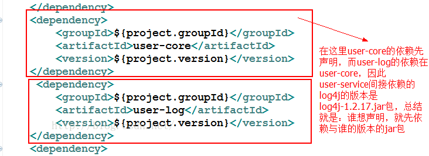

- main，test目录下面要标明java				

- 修改本定仓库位置：`<localRepository>F:/runtime/maven/repository</localRepository>`

- 修改镜像：阿里
  ``` xml 
  <mirrors>
     <mirror>
        <id>alimaven</id>
        <name>aliyun maven</name>
        <url>http://maven.aliyun.com/nexus/content/groups/public/</url>
        <mirrorOf>central</mirrorOf>       
      </mirror>
    </mirrors> 
  ```
- # 巨坑：

 >在setting.xml里记得设置好jdk版本，要不然每一次添加jar包的时候都会默认变回1.5！！
- maven 命令：
  ```maven
  mvn compile //编译
  mvn test   //测试
  mvn clean //清除target
  mvn package //打包
  ```


- # maven目录结构：


# pom.xml的简略讲解

## 1.scope

| name     | scope                                  |
| -------- | -------------------------------------- |
| comlipe  | 默认范围，依赖于所有的的classpath，会被打包             |
| provided | 当容器提供了之后才会使用，不会被打包，例如servlet-api       |
| runtime  | 在运行时依赖，编译不依赖，不打包，例如jdbc                |
| test     | 在一般的 编译和运行时都不需要，它们只有在测试编译和测试运行阶段用到，不打包 |
| system   | 指定不开源的jar或者非公开的jar。需要设置路径，不打包          |

# 各个模块之间的依赖
  1. 直接依赖 

     moduleA依赖于moduleB：A-->B

     A会依赖于B所依赖的module或者jar（传递性）

     **但是A不会依赖B中的scope为test的jar，B也不会依赖它所以来的module中的scope为test的jar **

  2. 间接接依赖
    情况1：
    **user-core**->**log4j.jar** (version=1.2.17)
    **user-log** ->**log4j.jar**(version=1.2.0)
    **user-service**->**user-log** && **user-service**->**user-core**
    **user-service**会根据谁先写在pom文件的最前面
    
       情况2：
    ​    A-->B-->C-->X.jar(version=1.1)
    ​    A-->D-->X.jar(version=1.2)
    ​    结果就是A——>X.jar(version=1.2)


  **总结：最短路径原则和最先申明原则**

