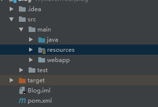

- main，test目录下面要标明java				

- 修改本定仓库位置：`<localRepository>F:/runtime/maven/repository</localRepository>`

- 修改镜像：阿里
  ``` xml 
  <mirrors>
     <mirror>
        <id>alimaven</id>
        <name>aliyun maven</name>
        <url>http://maven.aliyun.com/nexus/content/groups/public/</url>
        <mirrorOf>central</mirrorOf>       
      </mirror>
    </mirrors> 
  ```

- maven 命令：
  ```maven
  mvn compile //编译
  mvn test   //测试
  mvn clean //清除target
  mvn package //打包
  ```


# maven目录结构：




# 巨坑：

- 在setting.xml里记得设置好jdk版本，要不然每一次添加jar包的时候都会默认变回1.5！！